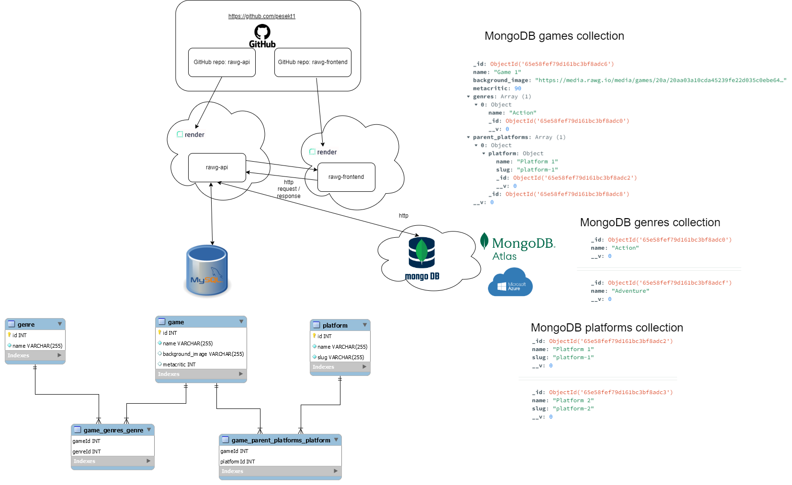

# RAWG API with TypeScript and node.js

This is just a quick attempt to have a look at the RAWG API and how to use it with node.js and TypeScript. We implemented both MongoDB and MySQL connection and models.

There are for sure many things to refactor and improve. There might also be some bugs. We tested it with the RAWG frontend for the functionality to get games, genres, and platforms from MongoDB, and genres from MySQL. We did not finish all the endpoints for MySQL.

## Setting up the project with TypeScript

```bash
npm init -y
npm install -D ts-node
```

now in package.json:

```json
"scripts": {
    "start": "ts-node src/index.ts"
}
```

now we can run:
```
npm start
```

Express:

```
npm i express
npm i -D typescript @types/node @types/express
```

create typescript compiler configuration file: tsconfig.json

```
tsc --init
```

create .env file:
```
MONGO_URI= "mongodb://localhost:27017/rawgdb"
```

Connect to MongoDB:

```javascript
import mongoose from "mongoose";

export default () => {
  if (!process.env.MONGO_URI) {
    throw new Error("MONGO_URI is not defined");
  }
  mongoose
    .connect(process.env.MONGO_URI)
    .then(() => console.log("Connected to MongoDB"))
    .catch((error) => console.error(error));
};
```

## Seeding the databases
There are folders data and data-sql containing sample data and the seeding scripts.

##
Scripts in package.json - we can run for example: npm run dev:
```json
  "scripts": {
    "build": "npm install && tsc",
    "start": "ts-node index.ts",
    "dev": "nodemon --exec ts-node index.ts",
    "seed": "ts-node ./data/seeder.ts",
    "seed-mysql": "ts-node ./data-sql/seeder.ts"
  },
```

## System architecture with deployment (client, server, databases)


